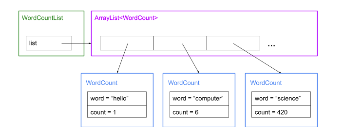

# PSA 2: WordCount
This PSA is due Tuesday, October 22, at 11:59 pm

## Introduction to PSA2
Using computer programs, we can systematically and efficiently extract information from text files in different ways. 

**In this assignment**, you will implement a program to:
1. Read from a file, count the occurrences of unique words
1. Remove some common words you just counted
1. Output the result to the console, or to a file
1. Find the most frequent words
1. (Optional Extra Credit) measure similarity between 2 files

In addition to these tasks, we will also introduce the process of Test-Driven Development (TDD), which requires programmers to write a tester for a method **before** implementing the method itself.


## Introduction to Test-Driven Development (TDD)
Some of the testing technique you used may be: print statements, using conditionals to compare the method output to expectation, etc. You will write similar unit tests in this assignment. The only difference is that, in test-driven development, you will write these individual testers for each method **before** writing code to implement the method. **As discussed in class, you should design your solution on paper first and thoroughly test your idea out on paper too. The test cases are excellent testing cases for your TDD testers.**

Test-driven development is useful when implementing large amounts of code. A few advantages:
1. Before the method is implemented, we expect all tests designed for this method should fail. We can verify this simply by running the tester and ensure that all test cases are well-designed.
1. While implementing the method, we can run the tester to see how many cases the method passed (or failed) to check progress. A programmer can write code solely for the purpose of passing the test cases.
1. Using unit tests, we can split a complex program into several smaller parts, and test them individually. Since it is easier to test a small unit, we can ensure the overall program is bug-free with less effort.


## Implementation 
In the following parts A - D, we will walk through each class and method of this assignment, and instruction on how to write the unit tests before implementing the method. 

As for testing (TDD for this PA), we have provided you with a **JUnit** testing file, called `WordCountListTest.java`, with few basic test cases. Like last PA, you are **not required** to submit this file but you should add your own test cases to both get more familiar with JUnit and test your methods thoroughly.

**Warning**: Do not modify any method signatures or instance variables, otherwise the grading scripts won’t be able to call the methods. You may add helper methods or variables, but you must not modify any method or variables given in the starter code.

## WordCount
A `WordCount` object stores a word as a String, as well as its count of occurrences as an int. You have to implement this `WordCount` class in a file called `WordCount.java` as part of your task.

### A. Instance Variables
```java
protected String word; 
protected int count; 
```

### B. Constructors
#### B-1 
This constructor creates a `WordCount` object and initialize its `word` with the parameter `word` and initialize its `count` to 1. 
```java
public WordCount(String word)
```
#### B-2
This constructor creates a `WordCount` object and initialize its `word` with the parameter `word` and initialize its `count` with the parameter `count`. 
```java
public WordCount(String word, int count)
```
#### B-3
This constructor creates a duplicate `WordCount` object by copying the `word` and `count` of the argument to initialize the new object's `word` and `count` instance variables. In other words, this is the "copy constructor." 
```java
public WordCount(WordCount wc)
```

### C. Increments the count by 1
This method increments the `count` of this WordCount object by 1 and returns the new `count` of this WordCount.
```java
public int increment()
```
### D. Increments the count by a certain amount
This method increments the `count` of this WordCount by the parameter `amount` and returns the new `count` of this WordCount. 
```java
public int add(int amount)
```
### E. Sets the count 
This method sets the `count` of this WordCount to the paramter `count` and returns the the new `count` of this WordCount.   
```java
public int setCount(int count)
```
### F. toString()
This method returns the String representation of this WordCount, which should be in this format: `word(count)`. For example, `Paul(100)` means that the word Paul shows up 100 times in the text file (which is kinda scary lol)
```java
@Override
public String toString()
```
### G. equals()
This method compares whether the `word` of this WordCount is equal to the `word` of the other WordCount. Note that the parameter passed in is an `Object` type, so we should use `instanceof` to check if `o` is an instance of WordCount at first before checking equality of `word`. If two WordCount objects have the same `word`, return true; else, return false.

**We already implemented this method for you in the starter code.**
```java
@Override
public boolean equals(Object o)
```

## WordCountList
Besides `WordCount`, you have to define a set of methods in `WordCountList.java`. `WordCountList` is a container class that contains an **ArrayList of `WordCount` objects**. For example, the following diagram describes a WordCountList with some words occurrences stored in it. 



Note: In all the following methods, you should make sure the underlying ArrayList that `list` references to, which is also the **instance variable** within the `WordCountList` class, exists (i.e **is not null**) first. If it doesn't, create a new empty ArrayList object for `list` before proceeding to the method. 

### A. Add a word to the list
```java
public void addWord(WordCount word)
```
This method adds a `WordCount` object to the `list`.

The algorithm of this method is as follow:

If the word already exists in the list, remove the word (technically it's a `WordCount`) from the list, increment its count by the count of the parameter word, and place it back but in the **correct location** of the list (See next paragraph about the ordering of words in the list). Otherwise, if the word doesn’t already exist in the list, add the word to the list and set its count to 1. 

The words should be added in increasing order of count, i.e., if there are two WordCounts "hi(1)" and "bye(2)" then "hi(1)" should be at index 0 and "bye(2)" should be at index 1. Note that this also means that **every time** a word is added, the list should be in the correct order. 

In the event that two words have the same count, use the lexicographic string order to break ties. 
You can use this Java String library function [`int	compareToIgnoreCase(String str)`](https://docs.oracle.com/javase/7/docs/api/java/lang/String.html#compareToIgnoreCase(java.lang.String)) to compare two strings lexicographically, ignoring case differences.
"Greater" strings should be at the end and "lesser" strings at the beginning, so if we had "hi(1)" and "bye(1)" and "bye < hi" then "bye(1)" would be at index 0 and "hi(1)" at index 1.

* Keep in mind that the ArrayList `list` contains `WordCount` objects.
* You might use this Java ArrayList library function [`int indexOf(Object o)`](https://docs.oracle.com/javase/8/docs/api/java/util/ArrayList.html#indexOf-java.lang.Object-) to check for existence of an element in the list. If the element exists, the method returns the **index** of the element in the list; else, the method returns `-1`. The **index** that `indexOf()` returns might be helpful for you to implement this `addWord()` method.
* **Do not ignore** punctuation: “apple” and “apple!” should be treated as different words
* **Ignore case**: when reading the file and incrementing each word, read words as lowercase. “Apple” and “apple” should both be read as "apple". 
#### A-1. Write the unit test first
In `WordCountListTest.java`, there is a method called `testAddWord()`. A couple very simple test cases are already provided for you. Put a few more test cases inside `testAddWord()` to check the functionality of `addWord()`. 

#### A-2. Implement the method
In `WordCountList.java`, implement `addWord()`, using the algorithm described above.

#### A-3. Test and debug
Follow the commands on the top of `WordCountListTest.java` to compile and run the JUnit test file. If any test case fails, debug your `addWord()` until all cases pass.

### B. Format all content into a String
```java
public String toString()
```
This method is called to format the words in the `list`, ArrayList of `WordCount`, into a String. If the ArrayList contains one occurrence of “a”, two occurrence of “is”, and three occurrences of “this”, then output of the toString() is: 
```
“a(1) is(2) this(3)”
```

Note that you can call your `WordCount`'s `toString()` method that you implemented above on each `WordCount` to implement this `WordCountList`'s `toString()`.

**Follow the exact format**: the return String for this method must follow the exact format above. Make sure there is a space between each word, and no extra characters other than the words, the parentheses, and the number in between.

### C. Read words from file into your program
```java
public void getWordsFromFile( String filename ) throws IOException 
```
This method populates the `list`, the ArrayList of `WordCount`, for each word in the file by calling the `addWord(WordCount word)` method on each word. The `throws IOException` clause is there because you will deal with file I/O in this method. 

* **Don’t use this anywhere else**: do not call getWordsFromFile() from other methods in `WordCountList`.

#### C-1. Write the unit test first
In `WordCountListTest.java`, there is a method called `testGetWordsFromFile()`. Put a few more test cases inside `testGetWordsFromFile()` to check the functionality of `getWordsFromFile()`. 

One very simple test case is already provided for you, as well as a file named `ExampleFile.txt`. 

In general, to create a test case for this method
1. Create a file, put some words in it 
1. Call `getWordsFromFile()`, pass in the filename from step 1
1. Verify the ArrayList content is what we expect

Be sure to check both normal and edge cases. Note the more rigorous you test your code, the more likely you will have perfect functionality in the end.

#### C-2. Implement the method
In `WordCountList.java`, implement `getWordsFromFile()`, using the algorithm described above.

#### C-3. Test and debug
Follow the commands on the top of `WordCountListTest.java` to compile and run the JUnit test file. If any test case fails, debug your `getWordsFromFile()` until all cases pass.

### D. Remove a given set of common words 
```java
public void removeWords(String omitFilename) throws IOException
```
This method will read **each word** from the specified file and remove that word from the ArrayList. Removing a word is **case insensitive** like in the methods before. You should assume that `list` only contains `WordCount`s with lower case Strings. 

For example, (hypothetically) say if before `removeWords()`, the list contains:
```
hello(1) this(2) is(3) computer(4) science(5)
```
And (hypothetically) inside a file named `small_common.txt`, there are these words:
```
This
is
the
```
Then, after calling `removeWords("small_common.txt")`, the list should contain:
```
hello(1) computer(4) science(5)
```
#### D-1. Write the unit tests
Like what we did previously, add more test cases inside the method `testRemoveWords()` in `WordCountListTest.java`.

You can write a test case by doing the following:
1. Create a file, put some words into it
1. Create a `WordCountList`, load some words into it
1. Call `removeWords()`, passing in the file name from step 1
1. Verify the ArrayList content is what we expect (i.e. common words removed, other words remain)

#### D-2. implement the method
In `WordCountList.java`, implement `removeWords()`, using the algorithm described above. 

#### D-3. Test and debug
Follow the commands on the top of `WordCountListTest.java` to compile and run the JUnit test file. If any test case fails, debug your `removeWords()` until all cases pass.


### E. Writing words to file 
```java
public void outputWords(boolean printToConsole) throws IOException
```
This method is called to print the words in the **Arraylist of `WordCount` objects**. This method takes in a boolean `printToConsole`. 
- If `printToConsole` is true, it should print the result of `toString() `on the screen. 
- If `printToConsole` is false, it should output the result of `toString()` to a file `myOutput.out`. 
* The output file should be written into the current path, and not using an absolute path but a relative path. By default, if you don’t provide any path (i.e. just putting the filename) when creating a file for output, Java will create the file in the folder where your java files are.

**Newline please!**: A newline should be printed after printing all the words in the console or the file.

You **don’t have to** write a unit test for this method, but it will be a good idea for you to call this method a couple times with different content and parameters, and check (either the console or the output file) to verify that your program is working correctly.

### F. Find K most frequent words
```java
public List<WordCount> topKWords(int k)
```
Returns a **deep** copy of the section of the list that contains the top K words. The order of the returned list should be opposite that of the original `list` when you `addWord()` from a file. The returned list of `topKWords()` should be sorted from highest count to lowest count (with the opposite tiebreaking as `addWord()` too). 

The algorithm of this method is as follow:

First, create a new ArrayList to store the topK WordCount objects. Since the original `list` is sorted from lowest count to highest count, you should start traversing the `list` from the end and grab and add the first K elements you traverse through to the topK resulted list and return that resulted list. 

**No printing**: topKWords() does not print/display anything.

**Not enough words?**: If the number of words is less than k, return all those words. For example k = 10 but you have only 5 words in the WordCountList, return those 5 words. 

#### F-1. Write the unit tests
Like what we did previously, add more test cases in the method `testTopKWords()` in `WordCountListTest.java`.

You can write a test case by doing the following:
1. Create a `WordCountList`, load some words into it
1. Call `topKWords()`
1. Verify the return value from step 2 is what we expect (i.e. correct words and correct counts, in correct order)

#### F-2. Implement the method
In `WordCountList.java`, implement `topKWords()`, using the algorithm described above. 

#### F-3. Test and debug
Follow the commands on the top of `WordCountListTest.java` to compile and run the JUnit test file. If any test case fails, debug your `topKWords()` until all cases pass.


## Extra Credit: Similarity Detector
The following methods will be defined in `Similarity.java`.

Write a simple plagiarism checker that uses Jaccard Similarity in order to determine how similar two texts are. The two methods you will be writing are the following:
```java
public static WordCountList findMax(WordCountList a, WordCountList b)
public static WordCountList findMin(WordCountList a, WordCountList b)
```
They should find the maximum and minimum number of occurrences of each word (again, case insensitive). For example, if the word “hello” appears 3 times and "hi" appears 1 times in file A, and "hello" appears 2 times and "hi" appears 4 times in file B, the WordCountList returned by findMax will have a WordCount for “hello” with a count of 3 and for "hi" with a count of 4. Likewise, the WordCountList returned by findMin will have a WordCount for “hello” with a count of 2 and for "hi" with a count of 1. If a word occurs in one file, but not the other, then the word occurs in the other file 0 times. The following diagram shows the basic idea of findMax method. findMin method would be very similar:

You should use the two above methods to write the following method to find the percent similarity between two documents. This can be found by dividing the sum of all minimum counts by the sum of all maximum counts and multiplying by 100. Remember to use floating point division. Continuing the example, the similarity between document A and B should be 3/7 (42.8571429%) because the sum of all the minimum counts is 3, which is 1 for “hi” + 2 for “hello”, and the sum of all the maximum counts is 7, which is 4 for “hi” + 3 for “hello”.

```java
public static double getSimilarity(WordCountList a, WordCountList b)
```
We also want to check for subset relation because a document that has every word in another document may not be considered similar based on the percentage generated by `getSimilarity` (as shown in the diagram below), but these documents should be similar so we should give our users a warning. Continuing the example, if document A is a subset of document B, this should return True. **The following method returns true if b is a subset of a.**
```java
public static boolean isStrictSubset(WordCountList a, WordCountList b)
```

When you are finished, write a main method in `Similarity.java` that checks for plagiarism between two documents given at the command line, where the first and second arguments are the names of the files you want to check similarity between. Don’t forget to have the program strip common words from both given files. For example, you can run `Similarity.java` in the following way:

```java
> java Similarity odyssey_shortened.txt odyssey_original.txt

Warning! odyssey_shortened.txt is a subset of odyssey_original.txt
The files have a 27.711406910798853% similarity.
```
This is by no means a sophisticated plagiarism detector because it does not consider words with similar meanings, but it does a good job determining file similarity if the files were directly copied.

## Summary 
In `README.md`, write about your test-driven development of your WordCountList: Tell us about how you approached this different angle of development. Provide a program description for each file you worked on. For example, `WordCountList.java` is a file you worked on, but not `WordCount.java`. However, you can mention WordCount when talking about WordCountList. 

The audience of the summary is anyone who knows **no programming or computer science**. This means use no ​Java or CSE terms, but high-level terms are fine. Write concisely, as if your reader needs to read 10 summaries at once. 

## Vim and Unix Commands 
In `README.md`, in a section named “commands”, answer the following short questions with short answers.

### Questions about Vim:
1. How do you delete 5 lines of codes (downward) in Vim with a single command?
1. What are the four direction key to navigate in command mode (not the four arrow keys) and which direction does each navigate?
1. How do you copy a single line in Vim? How do you paste what you copied below the current line?
1. How do you undo the last change in command mode? How do you redo the last undo in command mode? 
### Questions about Linux:
1. How do you remove a directory and all its contents from the command line?
1. List 3 flags you can use with the ls command and explain what they do (hint: type `man ls` at the command line).
1. How do you rename a file named `foo.f` to `bar.b` with one command from the command line? 
1. How do you navigate to the parent directory with one command from the command line?
1. How do you copy all file ending with `.java` in the current directory to the parent directory with one command?
### Survey: 
Please fill out the following survey, we will use your feedback to improve CSE8B. Every subsequent PA will also have its own survey. 
https://docs.google.com/forms/u/3/d/e/1FAIpQLScW1FvMW_kSVVBqdbZg2j4XU5ll-y2MmAPi0akkQvrxok7b-Q/viewform
1. Note down in your README that you have completed the survey. This is graded. 

## Submission 
**Submission Files** (Make sure your submission contains all of the files and that they work on the ieng6 lab machines!)

We will be running your tests. In addition to the Java programs, submit your test input files. 
* `WordCount.java`		
* `WordCountList.java`		
* `README.md`		
* `Similarity.java` [Extra Credit Optional]


## FAQ
* Since I’m reading words from file in getWordsFromFile(), should I store the words in an ArrayList<String>?

	No, you should be populating the ArrayList of WordCount objects, i.e ArrayList<WordCount>. WordCount Objects hold the String representation of the word and its count. 

* Do I have to create my own text files to test my program?

	Yes, you would want to have your own text files in which you know exactly what words there are and how many times they appear, so you would know exactly what your program should return with your custom made text file.

* I have to remove common words in my WordCountList using the removeWords() method. Let’s say I have “hello” in my current list of words and I have to remove “hello!”. Does that mean I have to remove ‘’hello” off my list?

	No, “hello!” and “hello” are treated as two different words. You will only have to remove “hello”, if the list of common words you have to remove contains exactly “hello”.
	How to call method X/what should be the calling object for method X?
	What class does method X belong to?

## Appendix
### toString

Every class in Java has access to a method called toString(). The purpose of the toString() method is to return a string representation of an object.
Suppose you create a class called Coordinate.java, in which each Coordinate object has an x-value and a y-value. You write two getter methods for this class: getX() and getY(). You then write the following code in your main method:
```java
Coordinate c1 = new Coordinate(10, 20);
System.out.println(c1);
```


This prints the memory address of the object. An example of something you may see on your screen after compiling and running this code is:
```
Coordinate@7852e922
```
However, this seemingly random/“garbage” series of letters and numbers isn’t very helpful for us. We can remedy this problem by defining a method called toString() in the Coordinate class:
```java
public String toString() {
return “The coordinates are: ” + this.getX() + “, “ + this.getY();
}
```
Now, when we call System.out.println() on a Coordinate object, its x and y coordinates will be printed out. For instance, System.out.println(c1) will now print:
```
The coordinates are: 10, 20
```

### Scanner
Use a Scanner object to read words from the file.
The Scanner Javadocs: http://docs.oracle.com/javase/8/docs/api/java/util/Scanner.html
The basic framework to use a Scanner in this PSA is:
```java
// Construct a Scanner that reads in words from a file
Scanner input = new Scanner( new File(fileName));
while ( input.hasNext() )  // while there are more words to be read in
{
word = input.next();  // reads next string
	…
}
```

### ArrayLists
ArrayLists are dynamically resizing arrays. In Java, standard arrays are initialized to a fixed size when first created. However, with ArrayLists, there is an initial size but when it becomes full, it automatically enlarges. When an element is removed, it automatically gets smaller. 


## WordCountList (Sample Output)
We have provided you with a file called `WordCountListRunner.java`, which you can use it to run and check the output from your methods against the sample output shown below. To use `WordCountListRunner`, first compile `WordCountListRunner.java`, then run using a command like:

```java
java WordCountListRunner nameOfInputFile numberOftopKWords {file|console}
```

The following is a sample of using the WordCountListRunner on the provided file (harry_potter.txt), printing the top 10 words to the console and to a file.

```
> java WordCountListRunner harry_potter.txt 10 console

Reading in File: inputFiles_DoNotSubmit/harry_potter.txt
Removing common words
Printing the top 10 words  on console
dursley(37) mr.(29) mrs.(19) --(13) people(12) he'd(8) cat(8) owls(7) dudley(7) thought(6)

> java WordCountListRunner harry_potter.txt 10 file

Reading in File: inputFiles_DoNotSubmit/harry_potter.txt
Removing common words	
Printing the top 10 words  in file a named myOutput.out

> cat myOutput.out
dursley(37) mr.(29) mrs.(19) --(13) people(12) he'd(8) cat(8) owls(7) dudley(7) thought(6)
```

## Similarity Checker (Sample Output)
```java
> java Similarity
This program takes exactly 2 arguments!

> java Similarity odyssey_original.txt odyssey_shortened.txt
Warning! odyssey_shortened.txt is a subset of odyssey_original.txt
The files have a 27.711406910798853% similarity.

> java Similarity odyssey_shortened.txt odyssey_original.txt
Warning! odyssey_shortened.txt is a subset of odyssey_original.txt
The files have a 27.711406910798853% similarity.

> java Similarity starwars.txt harry_potter.txt
The files have a 1.3054830287206267% similarity.

> java Similarity warandpeace.txt warandpeace.txt
Warning! warandpeace.txt and warandpeace.txt have the same contents!
The files have a 100.0% similarity.
```


